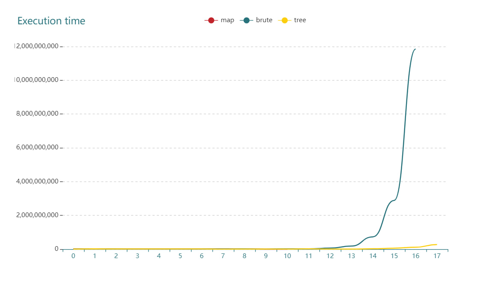
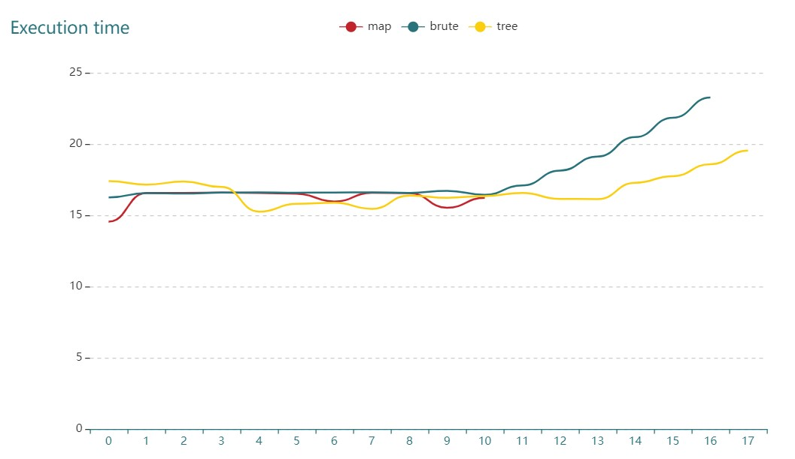
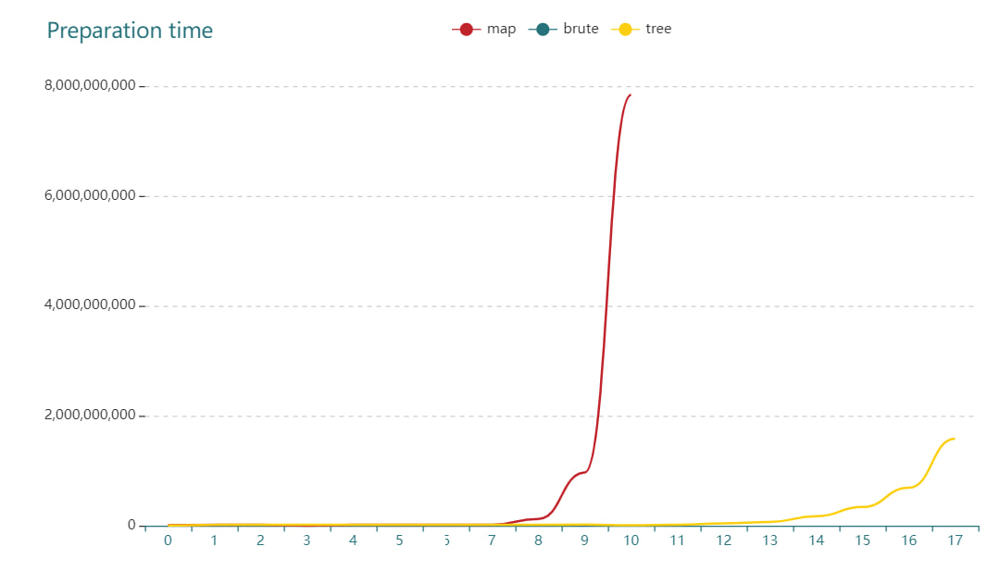
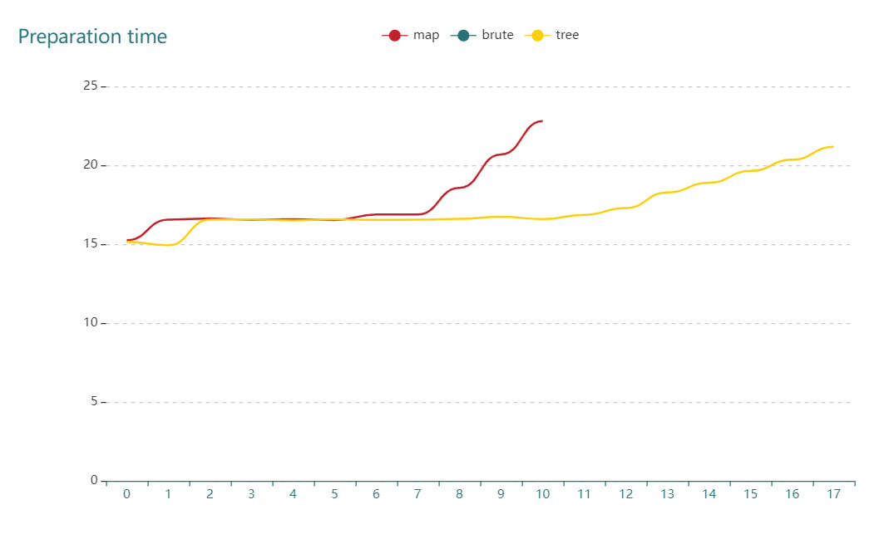
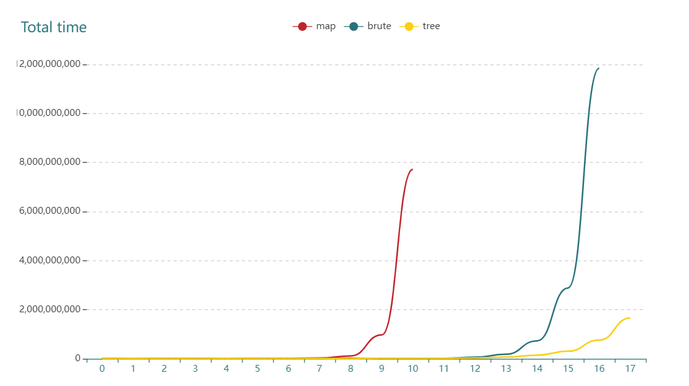
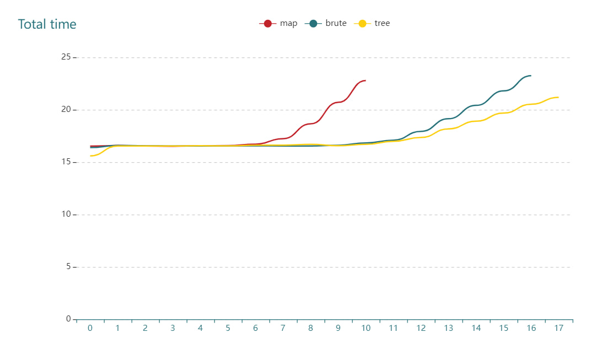

## Лабораторная работа №2
### Проверка принадлежности ```M``` точек к ```N``` прямоугольникам

---

### Стек реализации:
* golang 1.19.4
* go-echarts framework

### Структура проекта:
* internal - пакет с необходимыми для проекта функциями и типами
  * errors - пакет для ошибок
    * errors.go
  * generalfuncs.go - общие для всех алгоритмов функции
  * generaltypes.go - общие структуры и методы к ним для выполнения работы
* src - пакет для запуска реализций
  * v1.go - реализация решения влоб
  * v2.go - реализация через карту
  * v3.go - реализация через персистентное дерево отрезков
* tests - пакет для тестирования и бенчмарков
  * contest
    * v1 - пакет с бенчмарком и реализацией алгоритма для контеста через карту
    * v2 - пакет с бенчмарком и реализацией алгоритма для контеста через брутфорс
    * v3 - пакет с бенчмарком и реализацией алгоритма для контеста через персистентное дерево отрезков
* visualisation - пакет для построения графиков

---

### Входные данные:

```N``` прямоульников заданных через левый нижний и правый верхние края

```M``` точек заданных через x и y координаты

```go
    // тип точки
    type Point struct {
	X, Y int32
    }
	
    // тип прямоугольника
    type Rectangle struct {
        Lb, Ru Point
    }
```

### Решение №1

---

#### Алгоритмическая сложность по времени O(M * N)  
#### Алгоритмическая сложность по памяти O(1)  

---

Алгоритм заключается в полном переборе всех ```M``` точек
и проверки принадлежности их каждому из ```N``` прямоугольников

```go
  func checkSinglePoint(p internal.Point, rects *internal.Rectangles) int32 {
    var count int32
    for _, r := range *rects {
        if r.Belongs(p) {
            count++
	}
    }
    return count
  }

func BruteForce(r internal.Rectangles, ps internal.Points) {
  res := make([]int32, 0, len(ps))
  for _, p := range ps{ 
    res = append(res, checkSinglePoint(p, &r))
  }
}
```


### Решение №2

---

#### Алгоритмическая сложность по времени O(N^3) на построение карты и O(M * logN) на поиск ответа
#### Алгоритмическая сложность по памяти O(set(x) * set(y)), где set(x), set(y) - количество уникальных точек x и y в прямоугольниках

---

Алгоритм заключается в предварительном сжатии координат прямоугольников по обеим осям и их 
последующей сортировке с удалением повторов

#### Предобработка

```go
func (r *Rectangles) CompressCoordinates() ([]int32, []int32) {
	compXset := make(map[int32]struct{}, len(*r)*2)
	compYset := make(map[int32]struct{}, len(*r)*2)

	for _, rect := range *r {
		compXset[rect.Lb.X] = struct{}{}
		compXset[rect.Ru.X+1] = struct{}{}
		compYset[rect.Lb.Y] = struct{}{}
		compYset[rect.Ru.Y+1] = struct{}{}
	}
	
	// Получение уникальных значений
	compX := Keys(compXset)
	compY := Keys(compYset)
	sort.Slice(compX, func(i, j int) bool {
		return compX[i] < compX[j]
	})
	sort.Slice(compY, func(i, j int) bool {
		return compY[i] < compY[j]
	})

	return compX, compY
}
```

Далее составляется карта путём создание матрицы, имеющей ненулевые значения в тех позициях,
где есть прямоугольники (в сжатых координатах)

```go
func (r *Rectangles) BuildMap() ([]int32, []int32, [][]int32) {
	compX, compY := r.CompressCoordinates()
	rectMap := make([][]int32, len(compY))
	for i := range rectMap {
		rectMap[i] = make([]int32, len(compX))
	}

	for _, rect := range *r {
		lX := BinarySearch(compX, rect.Lb.X)
		lY := BinarySearch(compY, rect.Lb.Y)
		rX := BinarySearch(compX, rect.Ru.X+1)
		rY := BinarySearch(compY, rect.Ru.Y+1)

		for i := lY; i < rY; i++ {
			for j := lX; j < rX; j++ {
				rectMap[i][j]++
			}
		}
	}
	return compX, compY, rectMap
}
```

---

#### Поиск ответа

Поиск ответа происходит путём использования бинарного поиска и нахождения значения проверяемой точки
в сжатых координатах, при этом учитывается, что точки вообще не присутствует в диапазоне построения карты

```go
func CompressedMap(rects internal.Rectangles, p internal.Points) {
	res := make([]int32, 0, len(p))
	compX, compY, rectMap := rects.BuildMap()

	for i := range p {
		pX := internal.BinarySearch(compX, p[i].X)
		pY := internal.BinarySearch(compY, p[i].Y)

		if pX == -1 || pY == -1 {
			res = append(res, 0)
			continue
		}
		res = append(res, rectMap[pY][pX])
	}
}

```

### Решение №3

---

#### Алгоритмическая сложность по времени O(N*logN) на построение карты и O(M * logN) на поиск ответа
#### Алгоритмическая сложность по памяти O(N^2)

---
#### Предобработка

Алгоритм заключается в попытке оптимизации предобработки из [решения №2](#решение-2) путём замены карты на персистентное дерево отрезков

Для этого координаты сжимаются так же, как [тут](#предобработка), после чего составляется слайс событий, где под событием
подразумевается

```go
  type Event struct {
	X int32, // x-координата
	B int32, // начало покрытия по y
	E int32, // конец покрытия по y
	Stat int32 // тип события
}
```

Под покрытием понимается начало и конец прямоугольника по оси ``y``

Далее необходимо построить пустое дерево отрезков по пустому ``sample`` массиву длинной в кол-во сжатых координат

Далее проходимся по массиву событий и добавляем в отрезок ``[B, E]`` значение ``status``, создавая новые персистентные вершины

После завершения построения имеем ``compX`` персистентных узлов на каждый ``x``

#### Поиск ответа

Для получения ответа необходимо получить узел путём бинарного поиска по сжатым координатам
и спуска до нужного листа с суммированием значений в узлах

```go
func searchInTree(root *node, val int32) int32 {
	// if is not a leaf
	if root != nil {
		mid := (root.lRange + root.rRange) / 2

		// since descendants are sorted from top to bottom and from left to right
		if val < mid {
			return root.sum + searchInTree(root.left, val)
		} else {
			return root.sum + searchInTree(root.right, val)
		}
	}
	return 0
}

// PersistenceSegmentTree runs algorithm and prints result to stdout
func PersistenceSegmentTree(rects internal.Rectangles, ps internal.Points) {
	compX, compY := rects.CompressCoordinates()
	tree := BuildPersistentTree(&rects, compX, compY)
	var res []int32
	for _, p := range ps {
		// cX is a condition of a tree
		cX := internal.BinarySearch(compX, p.X)
		// is a value in a tree (point in compressed coordinates)
		cY := internal.BinarySearch(compY, p.Y)

		// coordinates out of bound
		if cX == -1 || cY == -1 {
			res = append(res, 0)
			continue
		}
		res = append(res, searchInTree(tree[cX], cY))
	}
}
```

## Тесты

---

Тестирование проводилось на следующих данных:
  * Число прямоугольников и точек равно ``2^n``, ``1 <= n <= x``
    * ``x = 11`` для [решения 2](#решение-2)
    * ``x = 18`` для [решения 1](#решение-1) и [решения 3](#решение-3)
  
### Графики

#### Время выполнения 
##### Обычные оси

##### Логарифмическая ось y


Из графиков видно, что время поиска ответа на алгоритмах [2](#решение-2) и [3](#решение-3) совпадают,
в то время как на тестовых данных от ``n=2^11`` решение брутфорсом начинает значительно проигрывать по времени,
что объясняется его линейной сложностью в отличие от логарифмической для других имплементаций

#### Время на предобработку
##### Обычные оси

##### Логарифмическая ось y


Алгоритм брутфорса был исключен из теста, так как не имеет времени предобработки

Из графиков видно, что на малых данных (до ``2^6``) разница между [решением 2](#решение-2) и [решением 3](#решение-3)
почти незаметна, однако уже после этих значений сложность обработки карты (``O(N^3)``) становится заметна и значительно 
отличается от времени обработки и построения дерева. Время выполнения для ``n=2^13`` становится столь велико, что ожидать
его выполнения слишком долго

#### Общее время
##### Обычные оси

##### Логарифмическая ось y



Из графиков наглядно видна разница в общей сложности алгоритмов. На малых данных разница несущественна для современного
компьютера, но начиная с ``2^5`` время для [решения 2](#решение-2) начинается стремительно увеличиваться из-за самой большой
сложности (``O(N^3)``), что делает алгоритм самым **неэффективным** среди представленных.

[Брутфорсный](#решение-1) алгоритм достойно показывает себя на данных примерно до ``2^15``, после чего его линейная сложность даёт о себе знать
и время выполнения становится достаточно велико

[Алгоритм на персистентном дереве](#решение-3) одинаково хорошо показывает себя на любых данных, что делает его самым **эффективным**
на любых данных

---

## Общий вывод:

Математически просчитанные сложности алгоритмов совпадают с полученными тестовыми данными

Использование любого из них - личное дело разработчика, однако я считаю, что живя в реальном мире
и применяя решение для точек до ``2^17`` без критической важности времени выполнения стоит использовать
брутфорсное решение ввиду простоты его реализации и отсутствия расходов доп. памяти.
Для данных большего размера разумно использовать дерево отрезков, однако ввиду сложности реализации
и большого расхода доп. памяти стоит быть **уверенным в том, что брутфорса недостаточно**

Использовать карту не имеет никакого смысла в виду более сложной, чем брутфорс, реализации, расхода памяти
амортизированно сопоставимого с алгоритмом на дереве и непозволительно большой сложностью предобработки данных 